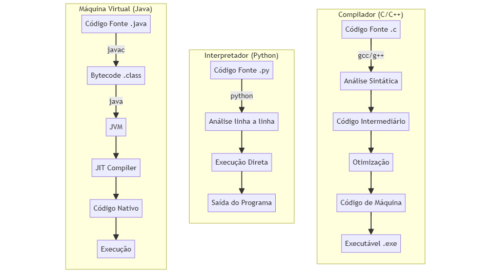

# Processo de Execução de Programas



## Exemplos Práticos

### 1. Compilador (C++)
```cpp
// arquivo: hello.cpp
#include <iostream>
int main() {
    std::cout << "Hello World!" << std::endl;
    return 0;
}
// Compilação: g++ hello.cpp -o hello.exe
// Execução: ./hello.exe
```

### 2. Interpretador (Python)
```python
# arquivo: hello.py
print("Hello World!")
# Execução direta: python hello.py
```

### 3. Máquina Virtual (Java)
```java
// arquivo: Hello.java
public class Hello {
    public static void main(String[] args) {
        System.out.println("Hello World!");
    }
}
// Compilação: javac Hello.java
// Execução: java Hello
```

## Comparação de Características

| Característica | Compilador | Interpretador | Máquina Virtual |
|----------------|------------|---------------|-----------------|
| Velocidade     | Rápido     | Mais lento    | Intermediário   |
| Portabilidade  | Baixa      | Alta          | Alta            |
| Debugging      | Mais difícil| Mais fácil    | Intermediário   |
| Exemplo        | C++        | Python        | Java            |

---

**Compiladores**: Geram código nativo otimizado
**Interpretadores**: Maior flexibilidade de desenvolvimento
**VMs**: Balanceiam portabilidade e performance